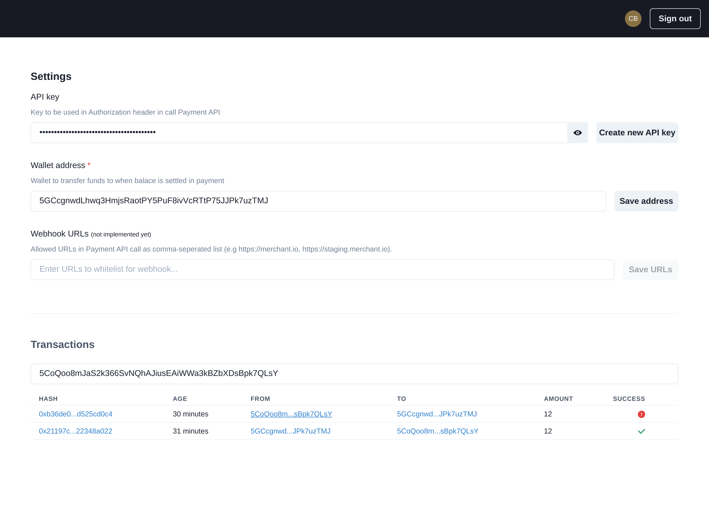
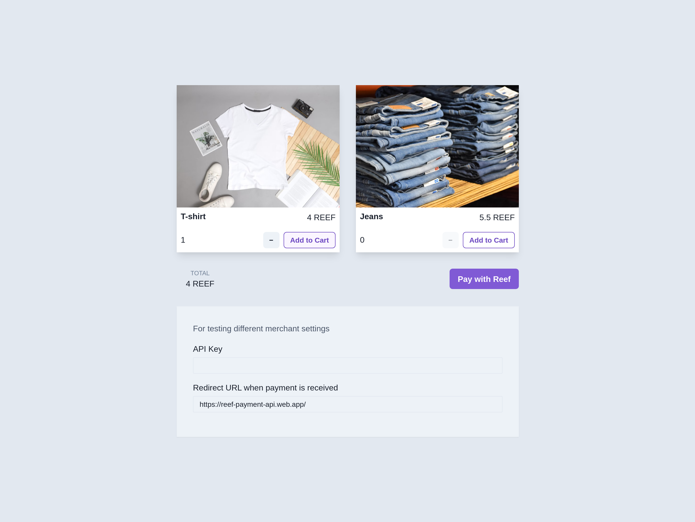

# Reef Payment API

- Demo: https://reef-payment-api.web.app/
- Merchant Demo: https://reef-payment-api.web.app/shop
- Video: https://www.loom.com/share/




#### Created as a submission to DeFi & Cross-Chain Interoperability Hackathon

- Link:
  https://gitcoin.co/issue/reef-defi/reef-finance-bounties/1/100026837

## Getting Started

First, run the development server:

```bash
npm run dev
# or
yarn dev
```

Open [http://localhost:3000](http://localhost:3000) with your browser to see the result.

#### Start the http api emulator

```bash
cd functions
npm run serve
```

API is now available at: http://localhost:5001/reef-payment-api/us-central1/api

## Instructions

- Go to http://localhost:3000 and sign in
- Create API key
- Enter wallet address
- Go to http://localhost:3000/shop and initiate a payment
- Copy the generated address and amount
- Run this command `REEF_ADDRESS="<address>" REEF_AMOUNT="<amount>" node payWallet.js `
