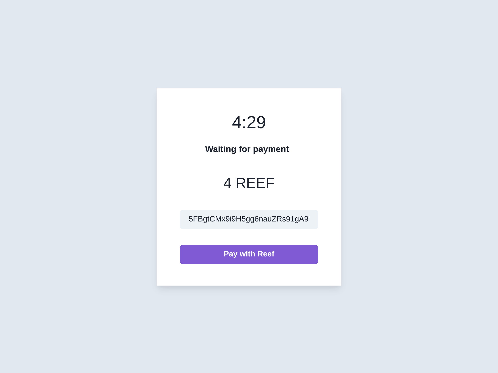

# Reef Payment API

Merchant payment API gateway on a Firebase function.

Works like this:

1. Merchant signs in with Google (can be extended to other providers)
2. Merchant generates API key and configures wallet address
3. Customer navigates to Merchant Shop and initiates a payment
4. Payment API generates random wallet and returns address and checkoutUrl
5. Customer navigates to checkoutUrl and sends payment to generated address
6. Payment API transfers incoming payment (minus tx fee) to configured wallet address and returns a success message and navigates to redirectUrl
7. Transactions to address is visible in Merchant Admin UI

- Demo: https://reef-payment-api.web.app/
- Merchant Shop Demo: https://reef-payment-api.web.app/shop
- Video: https://www.loom.com/share/c1dae7c082c74de5bcf2fa849cc26958

### Future improvements

- Refund payments (this must be done in the browser with the merchant wallet signed in with polkadot ext.)
- Admin UI to manage merchants

### Screenshots

#### Admin UI


#### Merchant Shop


#### Checkout page



#### Created as a submission to DeFi & Cross-Chain Interoperability Hackathon

- Link:
  https://gitcoin.co/issue/reef-defi/reef-finance-bounties/1/100026837

## Getting Started

First, run the development server:

```bash
npm run dev
# or
yarn dev
```

Open [http://localhost:3000](http://localhost:3000) with your browser to see the result.

#### Start the http api emulator

```bash
cd functions
npm run serve
```

API is now available at: http://localhost:5001/reef-payment-api/us-central1/api

## Instructions

- Go to http://localhost:3000 and sign in
- Create API key
- Enter wallet address
- Go to http://localhost:3000/shop and initiate a payment
- Copy the generated address and amount
- Pay in browser with Polkadot extension
